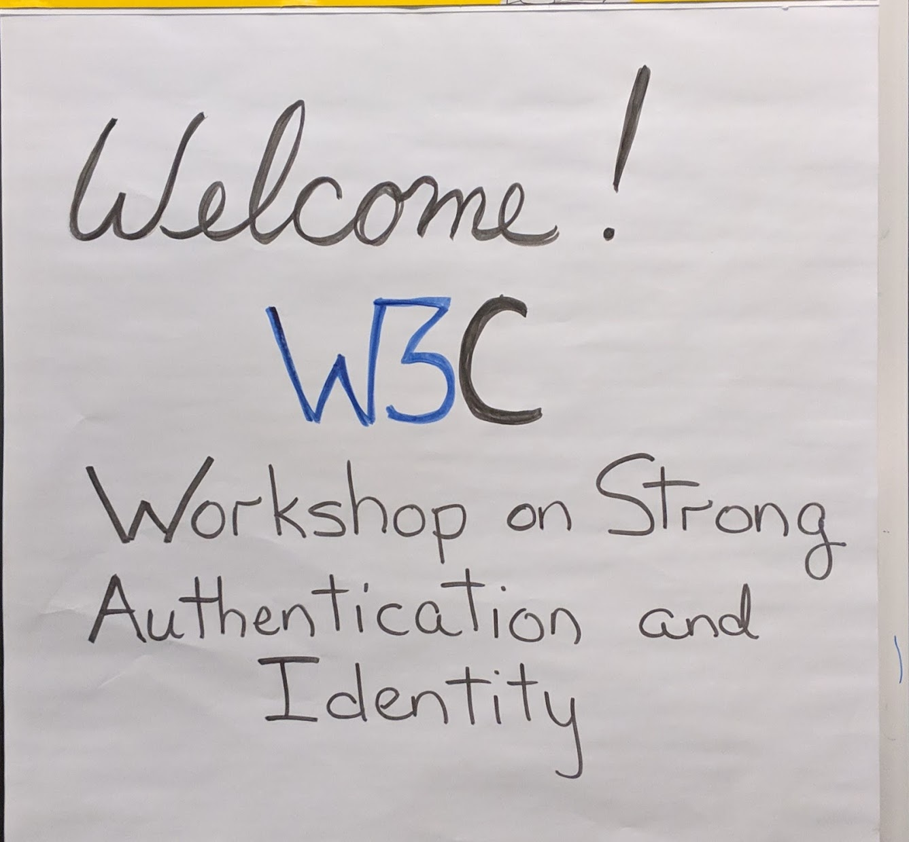

# 1. 简介

W3C强认证和身份验证技术研讨会聚集了该领域的专家，探讨现有的标准格局，研究现有的技术路线图，并确定有关强身份验证和强认证技术应如何在 web 上发挥作用的未来潜在工作。研讨会讨论了最近的 W3C 规范（WebAuthn、可验证声明、Web支付），以及 W3C 凭证社区组（DIDs、DIDsAuth）、IETF和ISO正在开展的工作，及其他现有社区标准（如IndieAuth、开放ID Connect、OAuth和SAML）。

  

     
    

# 2. 研讨会议程

[议程](https://www.w3.org/Security/strong-authentication-and-identity-workshop/agenda)

[实时记录](https://www.w3.org/Security/strong-authentication-and-identity-workshop/minutes.html) 

# 3. 演讲报告

我们对演讲报告进行了总结，并整理了讲者的演示文稿。有关讨论内容，请参阅[会议记录](https://www.w3.org/Security/strong-authentication-and-identity-workshop/minutes.html) 。

## 3.2. 可验证凭证

可验证凭证是持有者可以向验证者提供的对象，该对象显示发布方的声明。可验证凭证包含一个或多个声明、元数据、可选标识符和加密证明，防止数字文档被篡改。 W3C的可验证声明工作组正准备2019年发布可验证凭证数据模型1.0版（[Verifiable Credentials Data Model](https://w3c.github.io/vc-data-model/)） 推荐标准。

讲者演示文稿：[Understanding Verifiable Credentials](https://www.w3.org/Security/201812-Auth-ID/02_-_Day_1_-_Understanding_Verifiable_Credentials.pdf)

## 3.3. 分散标识符 (DID)

分散标识符(DID)是一种新型可验证的“自主权”数字身份标识符。DID完全受DID主体控制，独立于任何中心化的注册表、身份提供者或证书颁发机构。DID实现或“方法”必须指定针对目标分类账的创建、读取、更新和删除操作。DID“解析”到DID文档，这样通过其服务端点和加密密钥材料列表就可以启动身份验证和DID管理等操作。

W3C凭证社区组已经孵化了一份社区组报告草案，即分散标识符（DID）的数据模型和语法（[Data Model and Syntaxes for Decentralized Identifiers (DIDs)](https://w3c-ccg.github.io/did-spec/)）。W3C凭证社区组提议接下来[成立 W3C DID工作组](https://w3c-ccg.github.io/did-wg-proposal/)。

相关文档：

*   [DID 工作组章程提案](https://w3c-ccg.github.io/did-wg-proposal/)
*   [DID 用例](https://w3c-ccg.github.io/did-use-cases/)
*   [DID 规范](https://w3c-ccg.github.io/did-spec/) (由 W3C CCG 发布)

讲者演示文稿[Understanding DIDs](https://www.w3.org/Security/201812-Auth-ID/03_-_Day_1_-_Understanding_DIDs.pdf)

## 3.4. DID身份验证

在分散标识符（DID）社区中，术语“DID Auth”经常在各种环境中使用，然而，对于它是作为一个高级整体概念，还是作为一组具体协议却没有一个清晰的理解。如果我们考虑DID及其分布式公钥基础设施（DPKI）本质上提供了什么，那么“证明DID的控制”用于身份验证的目的似乎不仅非常有用，而且相对简单。

证明DID的这种控制，一般方法如下：1. 信任方向DID控制器发送质询; 2. DID控制器构造签名响应并将其发送给信任方; 3. 信任方将DID解析为DID文档; 4. 信任方使用DID文档中发现的公钥验证签名响应。

然而，除了这个基本流程之外，许多不同的项目目前正在使用不同的数据格式、传输机制和协议，以不同的方式实现高层次的概念。为了引入一些清晰的概念，Rebooting-the-Web-of-Trust 社区编写了一份[报告](https://github.com/WebOfTrustInfo/rebooting-the-web-of-trust-spring2018/blob/master/final-documents/did-auth.pdf) ，描述了“DID Auth”概念的范围及不同形式。

鉴于“DID Auth”目前仍是一个相对较新且未经证实的概念，现在有很多关于它如何与现有的身份验证技术相关联的讨论，如 OIDC 和 Web 身份验证（WebAuthentication）等，这些技术已经成熟且经过验证，并且具有很强的反相关性、反网络钓鱼和密钥管理的特性。

后续建议：

1. 作为“DID Auth”及其它基于 DID 的协议和应用程序的基线，继续完善 DID 以及 DID 分辨率规范

2. 续探索如何重新使用现有成熟的身份验证框架，如 OIDC 和 Web 身份验证（WebAuthentication），以及如何将这些协议的优势与 DID 的新特性结合起来。

讲者演示文稿[Understanding DID-Auth](https://www.w3.org/Security/201812-Auth-ID/04_-_Day_1_-_Understanding_DID_Auth.pdf)

## 3.5. Web身份验证、CTAP、EAT、FIDO 和身份验证器

现代身份验证：“FIDO 2”是 CTAP 和 WebAuthn 的总称。 CTAP（客户端到身份验证器协议）由 FIDO 开发; Web 身份验证（[Web Authentication](https://www.w3.org/TR/webauthn/)）是浏览器向信任方（web 应用程序）进行身份验证的 API，是 W3C 正式推荐标准。这两者一起为 Web 实现了强大的无密码身份验证。

EAT：IETF正在讨论中的实体认证令牌（EAT）提供设备来源认证。这种认证可用于 WebAuthn 和 FIDO，需要身份验证器强度的证明。

FIDO 和身份验证器。FIDO 联盟负责监督验证程序，确认身份验证器实现的安全性在一级至三级以上。

讲者演示文稿：[Understanding WebAuthentication, CTAP, EAT, FIDO, and Authenticators](https://www.w3.org/Security/201812-Auth-ID/05_-_Day_1_-_Understanding_WebAuthn,_CTAP,_EAT,_FIDO_and_Authenticators.pdf )

## 3.6. JWT / CWT，OpenID 和 IndieWeb

JSON Web令牌（JWT）是JSON中的声明表示。它可以用JWS进行签名，由OpenID Connect等使用。 OpenID Connect是OAuth 2.0之上的标识层。

[IndieAuth](https://indieauth.net/)：通过链接（URL）带入身份。提示用户输入身份，从链接（URL）中发现授权端点，向用户发送权限，在重定向返回时，交换访问令牌的授权代码和用户标准链接（URL）。

讲者演示文稿：[Understanding JWT/CWT, OpenID, and IndieWeb](https://www.w3.org/Security/201812-Auth-ID/06_-_Day_1_-_Understanding_JWT_CWT,_OpenID,_and_Related_Ecosystem.pdf)

## 3.7. 当前和未来所面临的挑战：

### 3.7.1 政府

来自不列颠哥伦比亚省政府的 Peter Watkins 分享了一些身份需求和挑战：例如各级的管辖、管理和背景（个人和公司、法定职称、专业证书、健康、教育、司法等）。 “如果我们这样做就该死，如果我们不这样做也该死（Damned if we do, damned if we don’t）”，提供身份验证/身份令牌，因为政府特定的身份有很高的价值/不经常使用；但依赖第三方进行政府识别存在隐私和问责担忧。

讲者演示文稿：[Government, Supply Chain, Legal](https://www.w3.org/Security/201812-Auth-ID/08_-_Day_1_-_Market_Verticals_-_Understanding_Current_and_Future_Problems.pdf)

### 3.7.2 医疗保健

Allen Brown 描述了将健康和医疗信息与身份结合起来所面临的挑战，其中包括军事野战医院或仅寻求零星紧急护理的平民患者。付费者、提供者、患者和数据都需要身份。

讲者演示文稿：[Healthcare](https://www.w3.org/Security/201812-Auth-ID/08.5_-_Day_1_-_Market_Verticals_-_Health_Care.pdf)

### 3.7.3. 垂直市场：供应链

Jim Masloski 分享了供应链分类账的挑战，它要求某些方面保持透明，而其他方面则要保密。使用 DID 识别代理，供应商和客户，并使用可验证凭证来描述产品和来源。挑战之一是从法定的表格中提取信息。

讲者演示文稿：[Government, Supply Chain, Legal](https://www.w3.org/Security/201812-Auth-ID/08_-_Day_1_-_Market_Verticals_-_Understanding_Current_and_Future_Problems.pdf)

### 3.7.4 垂直市场：法律

Scott David 针对有关 DID 的法律实践分享了他“温和”及“狂野”的观点。

讲者演示文稿：[Government, Supply Chain, Legal](https://www.w3.org/Security/201812-Auth-ID/08_-_Day_1_-_Market_Verticals_-_Understanding_Current_and_Future_Problems.pdf)

### 3.7.5 企业：曾几何时

John Fontana 在科技新闻领域工作了25年，涉及安全、目录、消息传递和身份，以及“从LDAP目录到我们现在的位置，以及已经完成了多少工作”。他谈到了标准需要的大量工作并赞扬了活动小组，同时表示现在通过标准进行的合作似乎比以往任何时候都要紧密。

[第一天议程结束]

## 3.8 探讨文化和经济视角

### 3.8.1 日本 ID 平台碎片化现状

Takashi Minamii 描述了日本采用的分散式和竖井式身份识别系统。在日本，企业集团建立自己的身份识别平台，而驾照就是最常见的了解客户的办法。他认为松散的身份联盟十分必要。

### 3.8.2自动识别标准

Shigeya Suzuki描述了结构化标识符，查看了包括 UPC 条形码在内的 GS1 标准。他建议有机会在 GS1 和 DID 之间进行工作交叉。

讲者演示文稿：[Cultural and Economic Perspectives](https://www.w3.org/Security/201812-Auth-ID/10_-_Day_2_-_Exploring_Cultural_and_Economic_Perspectives.pdf)

### 3.8.3 法律和边界

From an Asia Pacific perspective, Pindar Wong invited the group to think about the next billion+, making self-administered identifiers serve  netizen expatriates and displaced people whose right to work online is uncertain or unlawful as they have questionable legal standing or non-lawful status.

[slides:  Law and Borders: Self-Administered IDentifiers and NExTPats: NETizen eXpatriates](https://www.w3.org/Security/201812-Auth-ID/10.3_Day_2_-_PindarWong.pdf)

## 3.9. Trusted Identity

Tom Jones and Mary Hodder spoke of the challenges of providing and using a "trusted identity," one backed with verified claims upon which a recipient can rely. 

[slides: Use Case](https://www.w3.org/Security/201812-Auth-ID/12_-_Day_2_-_Trusted_Identity.pdf)

## 3.10. Avoiding Mistakes and Minefields

Jeff Hodges shared  common challenges on the path from idea through specification and implementation. He noted the errors of inconsistent terminology assumptions and models, and that trust doesn't scale. A principle of "flexitility was proposed  -- build something that is nominally useful yet malleable such that it can evolve to satisfy further use cases."

[slides: Avoiding Mistakes and Minefields](https://www.w3.org/Security/201812-Auth-ID/11_-_Day_2_-_Avoiding_Mistakes_and_Minefields.pdf)

## 3.11. Roadmap: Attestations

Mathias Brossard described attestation as a building-block for IoT security, starting from EAT and RAT. 

[slides: Attestation roadmap](https://www.w3.org/Security/201812-Auth-ID/13.5_-_Day_2_-_Attestation-Arm.pdf)

## 3.13. Roadmap: Decentralized Identifiers and Verifiable Credentials

Christopher Allen built a picture of the decentralized identity stack, from Verifiable Credentials (VCs), Decentralized Identifiers (DIDs), DID-Auth, and further potential technologies for future work. He shared the [Credentials Community Group's roadmap](https://w3c-ccg.github.io/roadmap/) [diagram](https://w3c-ccg.github.io/roadmap/diagram.html). 

[slides: DID & VC Architecture roadmap](https://www.w3.org/Security/201812-Auth-ID/13_-_Day_2_-_5_Year_Roadmap__DIDs,_VCs,_and_Attestations.pdf)

## 3.14. Roadmap: Biometrics

John Callahan focused on enterprise use of biometrics with proof-of-liveness enabling "roaming KYC." (Know Your Customer) 

[slides: Biometric Authenticators](https://www.w3.org/Security/201812-Auth-ID/14_-_Day_2_-_5_Year_Roadmap__Authenticators.pdf)

## 3.15. Roadmap: Payment Authentication

Marie Lathière described European regulations requiring strong customer authentication, proposing that delegating authentication to merchants, with WebAuthn, can enable good security and user experience.

[slides: the impacts of European regulation](https://www.w3.org/Security/201812-Auth-ID/14.5_Day_2_-_5_Year_Roadmap__Authenticators,_Gemalto.pdf)

# 4. Data Produced by Workshop

Participants broke-out into discussion groups several times. Some of their outputs were reported in [minutes](https://www.w3.org/Security/strong-authentication-and-identity-workshop/10Dec2018.html#item10). Other data were captured on index cards and "dot-voting" sheets. [These materials are linked](https://drive.google.com/drive/folders/190gzWNE-ynAk3DWsU2nN3B4Q2VL3W6IF?ths=true). 

# 5. Identified Trends

## 5.1. Integration of WebAuthn with Legacy Systems

There exist large legacy authentication systems that provide high assurance deployed and used by major governments and corporations. Two examples include the Common Access Card (CAC) and the Personal Identity Verification (PIV) card systems. There is work being performed to use this existing infrastructure to create "derived credentials" for use by newer authentication technologies such as that provided by the WebAuthentication specification, and potentially mechanisms provided via DID-Auth.

## 5.2. Decentralized Identifiers and Verifiable Credentials

A number of technology companies that participated in the workshop are involved with building solutions based on Decentralized Identifiers and Verifiable Credentials and integrating them with more traditional identity and credential issuing systems at large corporations and large governments. In many of these projects, W3C's focus on global interoperability and combating vendor lock-in were identified as key reasons that government and industry funding is being directed toward building an interoperable ecosystem. Many of the proof of concepts focus on interoperability at the Decentralized Identifier, Credential Issuer, Credential Holder (digital wallet), and Credential Verifier roles. While much of the work to date has focused on data models, there is increasing interest in interoperable protocols that move the interoperable data formats from DID Ledger to Issuer to Holder to Verifier.

## 5.3. Privacy-Enhancing Technologies

There is a strong trend towards privacy-enhancing technologies that place primary control of identifiers, credentials, and authenticators into the hands of individuals. There was also an identified desire to move away from centralized control and storage for information related to identifiers, credentials, and authenticators. While this bodes well for addressing a variety of recent data breaches and questions around data sovereignty, the community seemed to agree that there was still a great deal of work that needed to be done to ensure privacy-enhancing technologies were used by default in the future. Many in attendance at the workshop noted that constant vigilance would be required by the W3C community, as well as the greater technical community, to ensure the current trend continues.

# 6. Community Next Steps

The following next steps have been identified by members of the community:

*   The next Rebooting the Web of Trust (RWoT) is March 1-3 in Barcelona. All of these are expected to be active topics there, especially DIDs and the general direction of turning "DID Auth" into other existing protocols.
*   The next Internet Identity Workshop is April 30 through May 2 in Mountain View, CA. This too is expected to continue to advance the community dialog. [https://www.internetidentityworkshop.com/](https://www.internetidentityworkshop.com/)
*   W3C Credentials Community Group Roadmap: [https://w3c-ccg.github.io/roadmap/diagram.html](https://w3c-ccg.github.io/roadmap/diagram.html) 
*   IETF non-WG EAT list (Entity Attestation Token) [https://mailarchive.ietf.org/arch/browse/eat/](https://mailarchive.ietf.org/arch/browse/eat/) 
*   IETF non-WG RATS list (Remote ATtestation ProcedureS) [https://mailarchive.ietf.org/arch/browse/rats/ ](https://mailarchive.ietf.org/arch/browse/rats/) and draft charter [https://datatracker.ietf.org/doc/charter-ietf-rats/](https://datatracker.ietf.org/doc/charter-ietf-rats/) 

# 7. W3C Next Steps

The following next steps are currently under way at W3C:

*   DID charter out for advance-notice review:  [https://lists.w3.org/Archives/Public/public-new-work/2019Feb/0004.html](https://lists.w3.org/Archives/Public/public-new-work/2019Feb/0004.html) 
*   Verifiable Claims Data Model v1.0 nearing Candidate Recommendation: [https://w3c.github.io/vc-data-model/](https://w3c.github.io/vc-data-model/) 
*   WebAuthn API is a W3C Recommendation: [https://www.w3.org/TR/webauthn/](https://www.w3.org/TR/webauthn/). The WG is preparing v2 work.

Upcoming F2Fs and Meetings

*   The Verifiable Claims Working Group had a face-to-face meeting in Barcelona March 4-5, immediately following RWoT,
*   The Web Authentication Working Group met face-to-face in San Francisco, California, March 7, to work on level 2.
